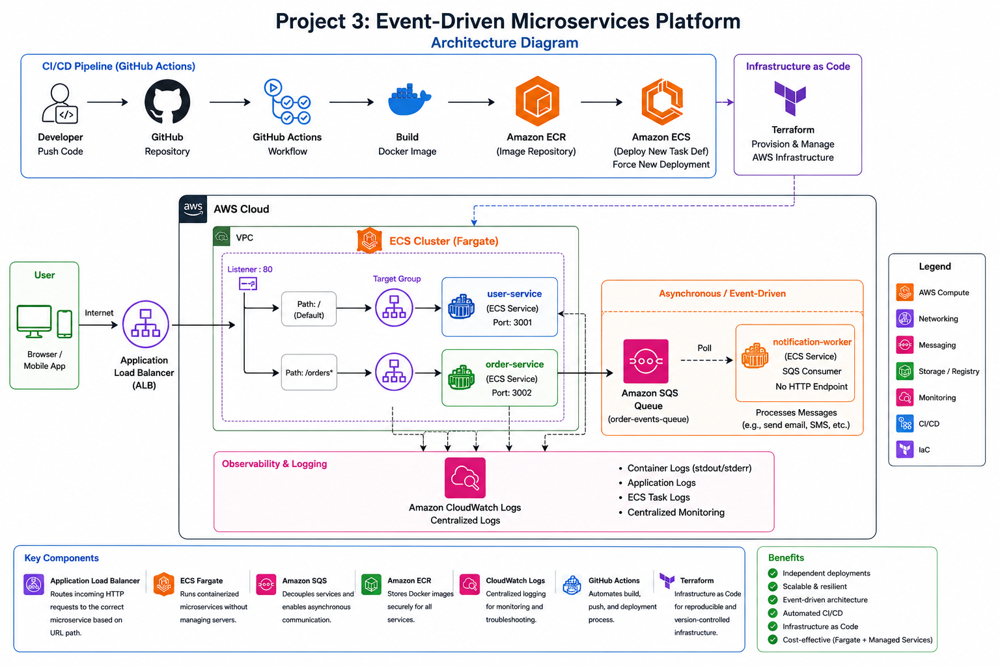

# Project 3: Event-Driven Microservices Platform

## Overview

This project demonstrates a cloud-native microservices platform deployed on AWS using containerized services, event-driven communication patterns, Infrastructure as Code, and automated CI/CD pipelines. The architecture is designed to simulate a modern SaaS backend where services are independently deployable, loosely coupled, and capable of scaling horizontally.

The implementation combines several key cloud-native concepts: microservices architecture, event-driven asynchronous processing, containerized deployments with Docker, managed container orchestration using ECS Fargate, infrastructure provisioning using Terraform, CI/CD automation using GitHub Actions, and centralised logging with CloudWatch Logs.

Unlike traditional monolithic applications where all functionality is tightly coupled into a single deployment unit, this platform decomposes functionality into smaller independently managed services communicating through APIs and asynchronous events.

## Business Scenario

A growing SaaS platform required a backend capable of supporting increasing deployment velocity, independent service ownership, and asynchronous business workflows. The previous monolithic deployment model created several operational problems: full redeployments for even minor code changes, tight coupling between business domains, difficult rollback procedures, no asynchronous processing model for background tasks, and manual deployment workflows prone to human error.

The solution decomposes the platform into three independently deployable services, introduces SQS for asynchronous event processing, provisions all infrastructure through Terraform, and automates every deployment step through GitHub Actions.

## Solution Summary

The solution implements a containerised microservices platform on AWS using ECS Fargate as the compute layer. Services are deployed independently behind an Application Load Balancer using path-based routing. Asynchronous workflows are implemented using Amazon SQS, enabling loose coupling between services. Terraform provisions the infrastructure while GitHub Actions automates the build and deployment pipeline.

The platform contains three services: user-service handling user-facing API requests, order-service processing order creation and emitting asynchronous events, and notification-worker consuming SQS events and performing background processing.

## Problem Being Solved

- **Environment inconsistency:** applications that behave differently in development versus production due to differing OS versions, library versions, or manual configuration steps.
- **Tight coupling between services:** a change to notification logic requires redeploying the entire application, increasing blast radius and deployment risk.
- **Independent scalability not possible:** order processing and notification delivery have different traffic profiles but a monolith cannot scale these independently.
- **Synchronous notification bottleneck:** if notification delivery is synchronous with order creation, a slow or failing notification system blocks order completion entirely.
- **Manual infrastructure:** infrastructure created manually through the console is not repeatable, not reviewable, and not recoverable without significant effort.
- **Manual deployments:** without a pipeline, every deployment is a manual error-prone sequence of CLI commands with no automated testing gate and no rollback mechanism.

## Architecture

The architecture separates synchronous HTTP request handling from asynchronous message processing into two distinct planes. User and order requests enter through the Application Load Balancer and are routed by path to the appropriate ECS service. Order events are published to SQS and processed independently by the notification-worker, which has no HTTP interface and is never registered with the ALB.

All services pull container images from Amazon ECR at task launch. All container output streams to CloudWatch Logs via the awslogs driver. IAM execution roles govern ECR pull and log delivery permissions per service.

**Architecture Diagram:**

 

## Architecture Flow

1. **Developer pushes code** — a commit to the main branch triggers the GitHub Actions workflow automatically.

2. **CI/CD pipeline executes** — the pipeline builds Docker images for all three services, pushes them to ECR tagged with the Git commit SHA, and triggers rolling ECS deployments. No manual steps are required after initial infrastructure setup.

3. **User request enters ALB** — users access the platform through the ALB DNS endpoint. The ALB evaluates path-based listener rules and routes to the correct ECS target group.

4. **ECS Fargate processes requests** — ECS services maintain healthy tasks across two Availability Zones. Fargate pulls images from ECR, starts containers, and registers tasks with the ALB target group. Unhealthy tasks are replaced automatically.

5. **Order service publishes event** — when the order-service receives an order request, it publishes an asynchronous message to SQS before returning the HTTP response. The response does not wait for notification processing.

6. **Notification worker processes queue** — the notification-worker continuously polls SQS using long polling. On receiving a message it processes the event, logs the result, and deletes the message from the queue. Failed messages are retried before moving to the dead-letter queue.

7. **Logs delivered to CloudWatch** — all container stdout and stderr is forwarded in real time to CloudWatch Logs via the awslogs driver. Separate log groups per service simplify troubleshooting and operational visibility.

## Services

**user-service**

Stateless Node.js HTTP API responsible for user data retrieval. Exposes a single endpoint and is designed to be independently deployable and scalable without any dependency on the order or notification subsystems. Runs on port 3000 behind its own ALB target group.

**order-service**

Handles order creation and acts as the integration point between the synchronous HTTP plane and the asynchronous messaging plane. When a POST /orders request succeeds, the service publishes an order event to SQS before returning the HTTP response. This is a fire-and-forget publish — the HTTP response does not wait for the notification to be processed. The IAM task role is scoped to sqs:SendMessage on the order events queue only.

**notification-worker**

Asynchronous SQS consumer with no HTTP interface and no ALB registration. Runs as an ECS Fargate task that continuously polls the queue using long polling. Processes messages, logs results, and deletes messages on success. On failure the message returns to the queue for retry; after the configured maximum receive count it moves to the dead-letter queue for investigation. Scales independently based on queue depth rather than HTTP traffic. The IAM task role is scoped to sqs:ReceiveMessage and sqs:DeleteMessage only — it cannot send messages.

## AWS Services Used

- **Amazon ECS Fargate** — runs all three services as containerized tasks without EC2 instance management. Each service is an independent ECS service with its own task definition, desired count, and Auto Scaling configuration.
- **Amazon ECR** — private repositories per service with tag immutability, automated vulnerability scanning on every push, and lifecycle policies managing image retention.
- **Application Load Balancer** — path-based routing to user-service and order-service target groups. Health checks deregister unhealthy tasks automatically and provide a stable DNS endpoint independent of individual task IPs.
- **Amazon SQS** — decouples order-service from notification-worker. Standard queue with a dead-letter queue, long polling, and SSE encryption at rest.
- **Amazon VPC** — Default VPC used for this implementation. ALB and ECS tasks both run in public subnets. In production, tasks would move to private subnets behind a NAT Gateway.
- **AWS IAM** — OIDC identity provider for GitHub Actions eliminating static access keys. Separate ECS execution role and per-service task roles, all least-privilege scoped to specific resource ARNs.
- **Amazon CloudWatch Logs** — separate log groups per service. awslogs driver captures all container output with configurable retention per environment.
- **Amazon CloudWatch Metrics** — ECS service metrics and ALB metrics available natively. SQS ApproximateNumberOfMessagesVisible drives notification-worker Auto Scaling.
- **Terraform** — all infrastructure as code. Remote state in S3 with DynamoDB locking. No resources created manually through the console.
- **GitHub Actions** — CI/CD pipeline triggered on push to main. OIDC authentication, Docker build, ECR push, ECS rolling deployment with stability verification.

## Infrastructure as Code — Terraform

All AWS infrastructure is defined in Terraform. No resources are created manually through the console. This makes the entire environment reproducible from a single terraform apply, peer-reviewable through pull requests, and recoverable without manual reconstruction.

| File | Resources provisioned |
|---|---|
| networking.tf | Default VPC used. Public subnets across two AZs referenced for ALB and ECS task placement |
| ecr.tf | Three ECR repositories (one per service), tag immutability, lifecycle policies |
| alb.tf | Internet-facing ALB, two target groups, path-based listener rules, health check configuration |
| ecs.tf | ECS cluster, three task definitions, three ECS services with desired count and Auto Scaling |
| sqs.tf | Order events queue and dead-letter queue |
| iam.tf | ECS execution role, per-service task roles scoped to specific resource ARNs |
| outputs.tf | ALB DNS name, ECR URIs, SQS queue URL — consumed by CI/CD pipeline without hardcoding |

Remote state is stored in S3 with DynamoDB table locking to prevent concurrent apply conflicts. State is never committed to the Git repository. S3 versioning enables recovery of previous state versions.

Each service has its own IAM task role scoped only to the AWS APIs it calls at runtime. The order-service can send SQS messages but cannot receive or delete them. The notification-worker can receive and delete but cannot send. The user-service has no queue access. This is a deliberate security boundary — compromising one service does not grant access to another service's resources.

## CI/CD Pipeline — GitHub Actions

Every push to the main branch triggers an automated pipeline. No manual deployment steps are required after initial infrastructure setup.

The pipeline checks out the repository, authenticates to AWS via OIDC with no long-lived access keys stored as GitHub secrets, logs into ECR, builds and pushes Docker images tagged with the Git commit SHA, updates the ECS services to the new image tags, and polls until all services reach a stable state. A failed health check fails the pipeline — old tasks remain in service until the issue is resolved.

Using the Git commit SHA as the image tag means every deployed image is fully traceable to an exact source code revision. Rolling back is a matter of redeploying the previous commit SHA, which always has a corresponding image in ECR.

The OIDC trust relationship is defined in Terraform as an IAM identity provider and role trust policy scoped to the specific repository and branch. No other GitHub repository can assume the deployment role.

## Security Considerations

- **Network isolation** — ECS tasks run in public subnets with public IPs assigned in this implementation. Security groups restrict all inbound access to ALB-originated traffic only. Private subnets with NAT Gateway is the documented production path.
- **Least-privilege IAM** — each service has its own task role scoped to only the AWS APIs it calls. The per-service breakdown is documented in the Services and Terraform sections above.
- **OIDC for CI/CD** — GitHub Actions assumes an IAM role via OIDC. No static AWS credentials are stored as repository secrets. Credentials are valid only for the duration of the pipeline run.
- **ECR private registry** — all images stored in private ECR repositories with IAM authentication and automated vulnerability scanning on every push.
- **SQS encryption** — order event messages encrypted at rest using SSE-SQS managed encryption.
- **Immutable ECR image tags** — ECR repositories configured with tag immutability. Production deployments reference commit-SHA tags preventing silent tag reassignment.
- **AWS WAF** — not yet configured. Recommended as the next security addition on the ALB with the Core Rule Set and rate limiting rules.

## High Availability & Scaling

ECS services are deployed across two Availability Zones. The ALB distributes traffic to healthy tasks in both AZs and automatically deregisters unhealthy tasks. ECS replaces failed tasks without manual intervention. Rolling deployments maintain capacity throughout a release by keeping the minimum healthy percentage at 100%.

The user-service and order-service scale on ALB RequestCountPerTarget — the correct signal for HTTP services. The notification-worker scales on SQS ApproximateNumberOfMessagesVisible — queue depth is the correct scaling signal for a consumer. A worker waiting on an empty queue has near-zero CPU, so CPU-based scaling would never trigger regardless of how many messages are waiting.

SQS absorbs traffic bursts independently of ECS capacity. If the notification-worker temporarily falls behind, messages accumulate durably in the queue rather than being dropped. The dead-letter queue captures messages that fail after the configured retry count for manual investigation.

## Key Decisions & Trade-offs

**Microservices over monolith**

Three services means three pipelines, three ECR repositories, and three sets of IAM roles — a larger operational surface than a single deployment unit. The trade-off is justified because each service has a distinct responsibility and a distinct scaling profile. The notification-worker scales on queue depth independently of HTTP traffic. A monolith forces all three concerns to scale and deploy together, and a change to notification logic requires redeploying the user and order APIs.

**SQS over synchronous notification**

SQS introduces eventual consistency — the user receives an HTTP response before the notification is guaranteed to be processed. The trade-off is the right choice here because synchronous notification would couple order creation latency directly to the notification system. A slow or unavailable notification service would degrade every POST /orders call. SQS absorbs bursts and decouples failure domains — order creation succeeds even if the notification-worker is temporarily down.

**ECS over EKS**

ECS provides the necessary orchestration — task scheduling, health checks, rolling deployments, Auto Scaling — at significantly lower operational overhead than EKS. Kubernetes adds control plane management, node group upgrades, and networking add-ons without proportional benefit for three services with straightforward patterns. EKS is the right evolution when service count and inter-service complexity genuinely justifies it.

**Public ALB over API Gateway**

ALB was chosen for simplicity and lower operational overhead for container-based HTTP routing. API Gateway would provide request throttling, API key management, and API lifecycle tooling, but introduces architectural complexity that is not needed for this workload. ALB integrates natively with ECS target groups and path-based routing at lower cost and with fewer moving parts.

**Terraform over CloudFormation**

Terraform is the dominant IaC tool in the industry, appearing in the majority of cloud engineering job postings. HCL is more readable than CloudFormation YAML for complex configurations and the provider ecosystem extends beyond AWS. The remote state model with S3 and DynamoDB locking is well understood and operationally straightforward.

**Standard SQS over FIFO**

Standard queues provide at-least-once delivery — the notification-worker may occasionally receive duplicate messages. FIFO throughput limits and additional cost are not justified here because order notifications are idempotent. Processing the same notification twice has no harmful side effect. If the notification action involved a financial transaction or a database write requiring exactly-once semantics, FIFO would be the correct choice.

## Lessons Learned

Several practical lessons were encountered and resolved during implementation. Each one reinforced a real-world architectural principle.

**CloudWatch log groups must exist before ECS tasks start.** ECS tasks fail with a ResourceInitializationError if the CloudWatch log group referenced in the task definition does not exist in the correct region. Terraform solves this by creating log groups before the ECS service as part of the same apply — resource dependency ordering is handled automatically when resources are correctly declared.

**ECS rolling deployments run two task versions simultaneously.** During a deployment, both old and new tasks are briefly registered with the ALB target group. Traffic is distributed across both versions until health checks confirm the new tasks are healthy. This is expected behaviour but must be accounted for in application design — APIs should be backward-compatible during the transition window.

**Terraform destroy depends entirely on state accuracy.** terraform destroy only removes resources tracked in the Terraform state file. Resources created outside Terraform or after state was last updated are not destroyed. This reinforced the discipline of managing all resources through IaC from the start of the project.

**ECR repositories require force deletion when images exist.** terraform destroy fails on an ECR repository that contains images unless force_delete = true is set in the resource configuration. This is a safety default rather than a bug, but must be explicitly handled in development and portfolio environments.

**GitHub Actions requires workflow permissions for pipeline file changes.** Workflows that modify .github/workflows/ files require the contents: write permission in the workflow YAML or a Personal Access Token with workflow scope. The standard GITHUB_TOKEN does not include this permission by default.

## Disaster Recovery

| Failure scenario | Recovery behaviour |
|---|---|
| Single ECS task crash | ECS detects failure within 30 seconds and launches a replacement. ALB deregisters the unhealthy task automatically. No manual action required. |
| Single AZ outage | Tasks in the surviving AZ continue serving traffic via the multi-AZ ALB. ECS launches replacements in the surviving AZ until the failed AZ recovers. |
| Bad container image deployed | New tasks fail health checks. Rolling deployment stops. Old tasks remain registered and in service. Rollback: update ECS service to previous commit SHA image. |
| SQS message backlog | Messages accumulate durably in the queue. Auto Scaling increases worker task count based on queue depth. No messages are lost. |
| Worker crash mid-processing | Message returns to queue after visibility timeout expires. Retried up to the configured maximum before moving to the dead-letter queue. DLQ alarm triggers investigation. |
| Full region failure | Single-region architecture. Recovery: terraform apply in a secondary region using the same code. ECR cross-region replication recommended for image availability. Target RTO: under 60 minutes. |

## Cost Estimate

The following estimate covers the baseline infrastructure cost running in eu-central-1. All figures are approximate and based on AWS public pricing as of 2025.

Assumptions: 2 tasks per service (6 Fargate tasks total), 0.25 vCPU and 0.5 GB memory per task, 20 GB ECR storage across all repositories, moderate ALB traffic, and 1 GB CloudWatch Logs ingestion per month.

| Component | Estimated monthly cost |
|---|---|
| ECS Fargate — compute (6 tasks × 0.25 vCPU × 730 hrs) | ~$18 |
| ECS Fargate — memory (6 tasks × 0.5 GB × 730 hrs) | ~$6 |
| Application Load Balancer | ~$18 |
| Amazon ECR (20 GB storage) | ~$2 |
| Amazon SQS | ~$0.40 |
| CloudWatch Logs | ~$1 |
| S3 and DynamoDB (Terraform state) | ~$0.50 |
| **Total baseline** | **~$46 / month** |

The dominant cost at baseline is the Application Load Balancer, which carries a fixed hourly charge regardless of traffic volume. Fargate compute and memory scale linearly with task count and are the primary cost driver at higher scale.
The most impactful cost optimisation at production scale is adding VPC endpoints for ECR and CloudWatch.
Moving ECS tasks to private subnets — the recommended production path — requires a NAT Gateway for outbound traffic, which costs approximately $72/month for two AZ-redundant gateways. VPC endpoints for ECR and CloudWatch route image pull and log delivery traffic privately within AWS, significantly reducing the NAT Gateway data processing charge for those high-frequency flows.

At peak scale with 10 tasks per service, the Fargate compute line grows to approximately $150/month. Fargate Savings Plans at 1-year commitment reduce compute and memory costs by approximately 20% and are worth purchasing once baseline task count is stable after a few weeks of production traffic data.

## Key Outcomes

This project demonstrates end-to-end ownership of a cloud-native platform — from application code through containerisation, infrastructure provisioning, and automated deployment. The three-service architecture cleanly separates synchronous HTTP concerns from asynchronous event processing, showing event-driven thinking and an understanding of where coupling creates operational risk. Terraform provisions the entire environment reproducibly with least-privilege IAM and no manually created resources. The GitHub Actions pipeline with OIDC authentication automates every deployment step with full traceability from Git commit to running container. Together with Projects 1 and 2, this portfolio covers the full cloud engineering spectrum: traditional HA infrastructure, container-native deployment, and automated microservices with IaC — reflecting how modern cloud platforms are built and operated.
